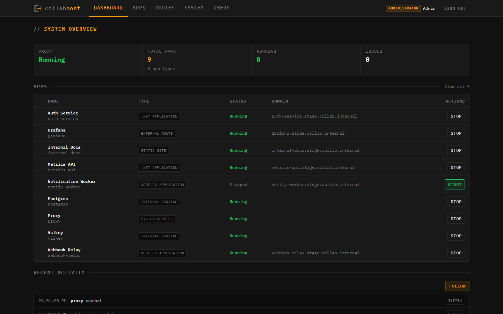
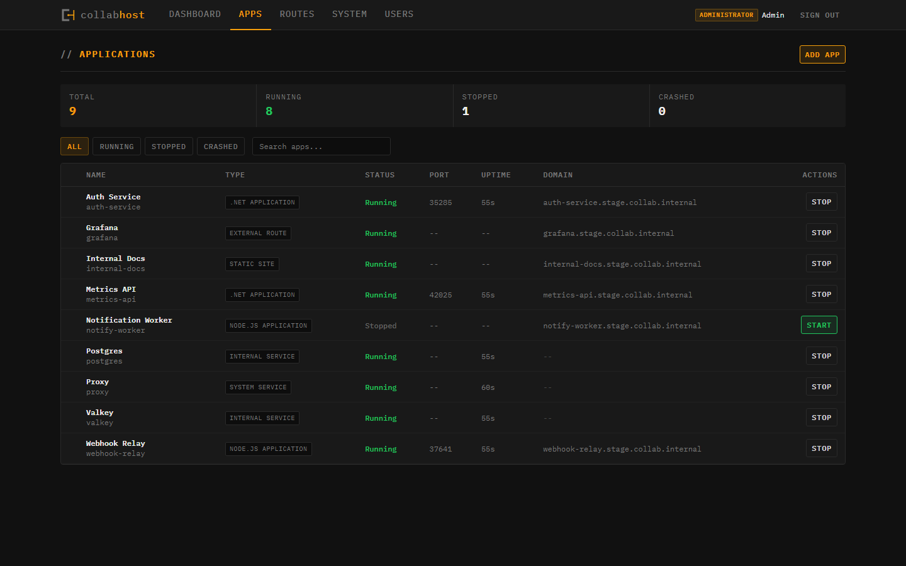
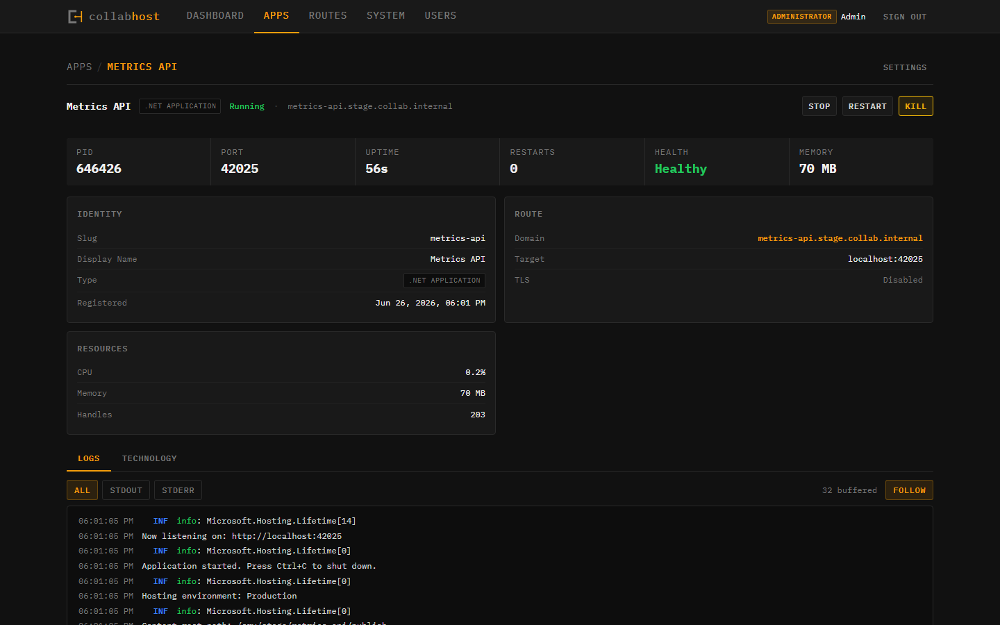
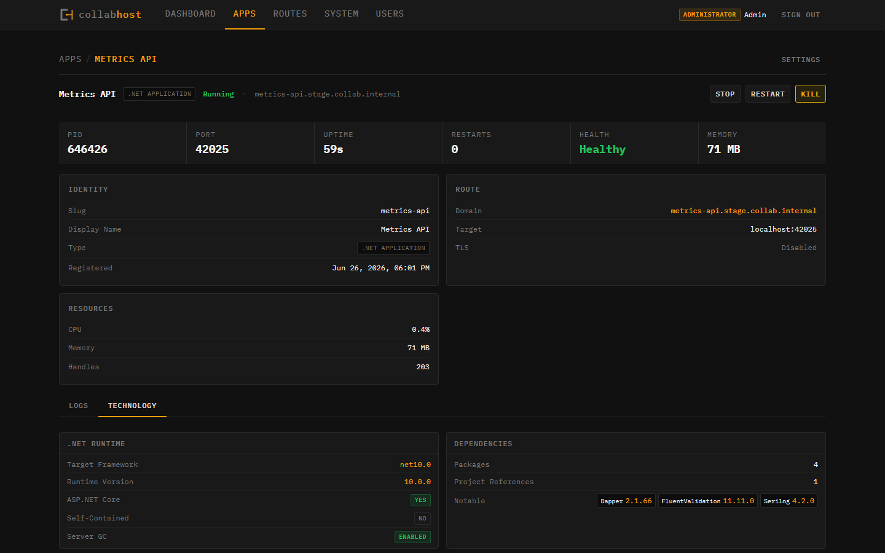
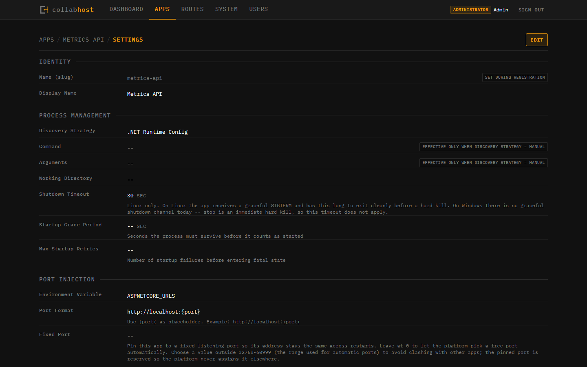
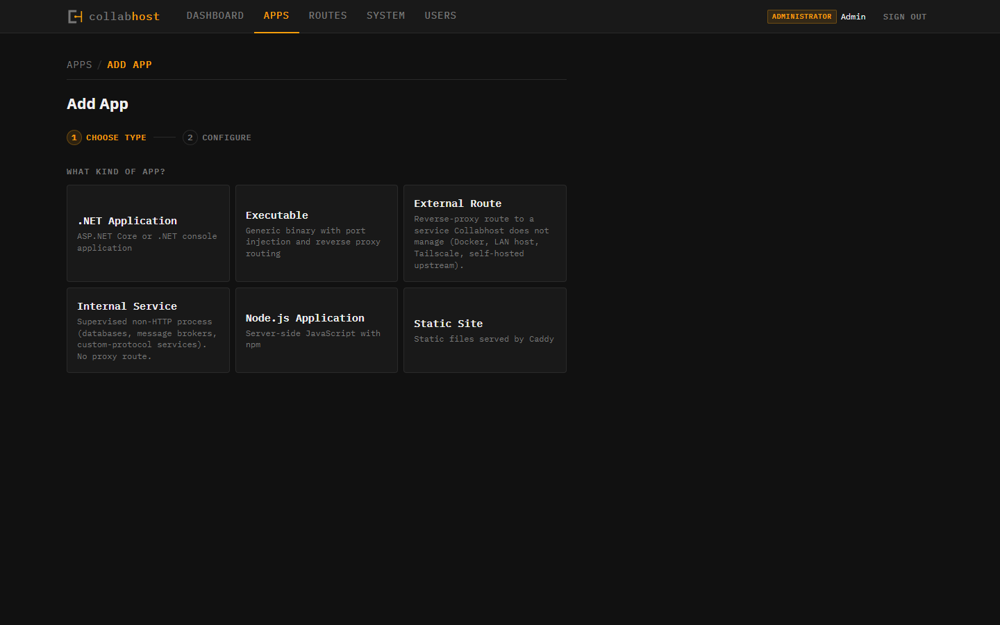
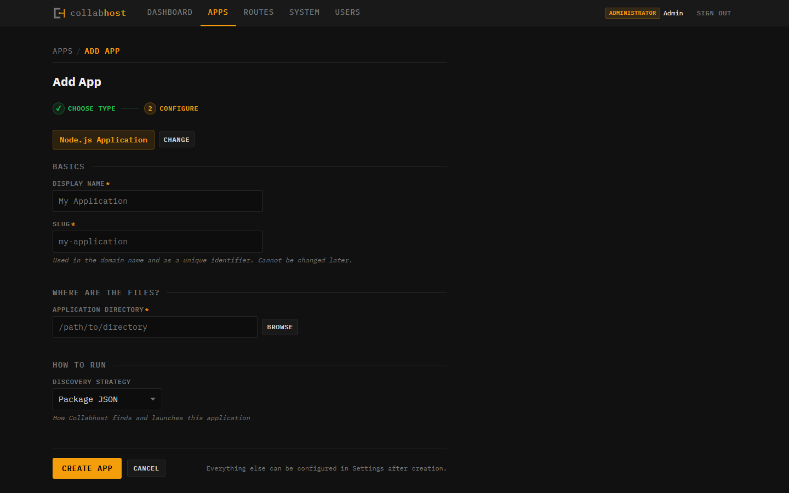
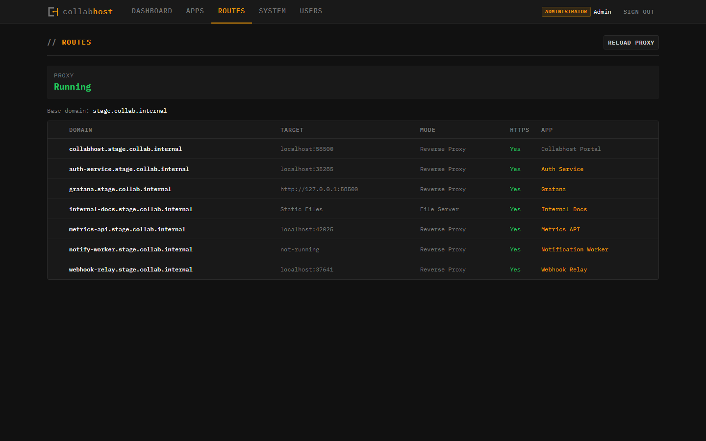

<p align="center">
  
</p>

<h1 align="center">Collabhost</h1>

<p align="center">
  A self-hosted control plane for your workstation — operated from a dashboard, or driven by agents through a built-in MCP server.<br/>
  First-class on Windows and Linux. Runs on macOS as best-effort.
</p>

<p align="center">
  <a href="https://github.com/MrBildo/collabhost/actions/workflows/ci.yml"></a>
  <a href="LICENSE"></a>
  <a href="https://dot.net/download"></a>
  <a href="https://nodejs.org/"></a>
</p>

---

## What is Collabhost?

Collabhost gives you a single control plane for everything running on your machine — .NET services, Node.js apps, static sites, MCP servers, and arbitrary executables. Register an app, point it at a directory, and Collabhost handles process supervision, reverse proxy routing, log aggregation, and crash recovery. No containers. No YAML. No cloud account.

**Two first-class audiences.** An operator runs Collabhost from a War Machine dashboard — tables, log streams, inline actions. An agent runs Collabhost through a built-in MCP server — the same surface, exposed as tools over Streamable HTTP. Register an app from the UI or from Claude Code. Start, stop, tail logs, update settings. Humans and agents share one platform, one auth model, and one source of truth.

If you're building an AI harness, agent framework, or multi-agent system that needs to manage local infrastructure, Collabhost is the layer that sits underneath. See [For Agents](#for-agents) for MCP configuration.

It runs natively on **Windows** and **Linux** with platform-specific process management — no WSL required on Windows, no emulation layer on Linux. macOS works too, in a best-effort mode with reduced process containment — see [Platform support](#platform-support) for the tier breakdown. Think of it as a lightweight, self-hosted Heroku for your workstation — a control plane that stays out of your way until something goes wrong.

<p align="center">
  
</p>

<p align="center"><sub>The dashboard. Process supervision, routing, and a live activity feed on one screen.</sub></p>

## Features

**Built-in MCP server** — A Model Context Protocol endpoint at `/mcp` exposes the operator surface as tools. 18 tools across discovery, lifecycle, configuration, registration, and activity. Agents register apps, start and stop processes, tail logs, update settings, and browse the host filesystem — programmatically, over Streamable HTTP. Role-aware: administrators see everything, agents see 17 of 18 tools (everything except `delete_app`). See [For Agents](#for-agents) for setup.

**Operator dashboard** — Real-time stats, app table with inline actions, live activity feed, and streaming log viewers. Everything an operator needs on one screen. The War Machine design system — dark, monospace, industrial — is built for density and quick action.

**Process supervision** — Start, stop, restart, and kill managed processes with platform-native implementations for both Windows and Linux. On Windows: processes launch via `CreateProcess` with dedicated process groups, graceful shutdown via `GenerateConsoleCtrlEvent`, and orphan protection through Win32 Job Objects that guarantee child process cleanup even if Collabhost crashes. On Linux: process groups with `SIGTERM`/`SIGKILL` lifecycle and cgroup-based containment. Crash detection with automatic restart and configurable exponential backoff. Stdout/stderr captured into in-memory ring buffers.

**Reverse proxy** — Every app gets a subdomain route automatically configured through [Caddy](https://caddyserver.com/). HTTPS via Caddy's internal CA. Routes sync on process state changes — no manual proxy config. The base domain is configurable in `appsettings.json`.

**Schema-driven configuration** — App settings are defined by capability schemas. New capabilities surface in the UI and through MCP without frontend or tool changes. Override defaults per-app, see what's customized vs. inherited.

**Multi-runtime support** — Five built-in app types out of the box:

| Type | What it runs |
|------|-------------|
| `dotnet-app` | .NET applications (auto-discovers project files) |
| `nodejs-app` | Node.js applications (reads package.json scripts) |
| `static-site` | Static file directories (served via Caddy file_server) |
| `executable` | Arbitrary binaries and scripts |
| `system-service` | Platform services managed by Collabhost itself |

**User management** — Header-based auth with administrator and agent roles. One-time API key reveal on creation. The same key authenticates the dashboard, the REST API, and the MCP server — mint a key for an agent and it can operate the platform.

**Technology probing** — Automatic detection of runtimes, frameworks, and dependencies for registered apps. No manual tagging required. Surfaces in the dashboard and in `get_app` MCP responses.

## Platform support

Process supervision is the piece of Collabhost that differs most by platform. The control plane itself — API, dashboard, MCP server, SQLite, Caddy integration — runs identically everywhere .NET 10 does. Process containment does not.

| Platform | Tier | How processes are supervised |
|---|---|---|
| **Windows** | **First-class** | `CreateProcess` P/Invoke with dedicated process groups, graceful shutdown via `GenerateConsoleCtrlEvent`, orphan protection through Win32 Job Objects. |
| **Linux** | **First-class** | `setsid` process groups with `SIGTERM`/`SIGKILL` lifecycle, cgroup v2 containment. Orphan-proof. |
| macOS | *Best-effort* | `FallbackProcessRunner`. Processes start and stop. No Job Objects, no cgroups, no orphan protection — if Collabhost crashes, child processes may outlive it. |

Windows and Linux are the supported deployment targets. macOS is supported for local development and tinkering; don't expect parity.

## A tour

<p align="center">
  
</p>

<p align="center"><sub>App list. Filter by state, search, start and stop with one click.</sub></p>

<br/>

<p align="center">
  
</p>

<p align="center"><sub>App detail. PID, port, uptime, route target, and live log streaming.</sub></p>

<br/>

<p align="center">
  
</p>

<p align="center"><sub>Technology probe. Collabhost detects runtimes, frameworks, and notable dependencies automatically.</sub></p>

<br/>

<p align="center">
  
</p>

<p align="center"><sub>Schema-driven settings. Every capability surfaces here without frontend changes.</sub></p>

<br/>

<table>
  <tr>
    <td width="50%" align="center">
      
      <br/>
      <sub>Register, step 1. Pick a type.</sub>
    </td>
    <td width="50%" align="center">
      
      <br/>
      <sub>Register, step 2. Configure.</sub>
    </td>
  </tr>
</table>

<br/>

<p align="center">
  
</p>

<p align="center"><sub>Routes. Every app gets an automatic <code>{slug}.collab.internal</code> subdomain with HTTPS (the base domain is configurable).</sub></p>

## Quick Start

### Prerequisites

- [.NET 10 SDK](https://dotnet.microsoft.com/download)
- [Node.js 22+](https://nodejs.org/) (for the dashboard)
- [Caddy](https://caddyserver.com/) (recommended — required for reverse proxy routing; Collabhost runs without it, but apps won't get automatic subdomains)

### Install Caddy

Collabhost manages Caddy as a supervised process — you install the binary, Collabhost handles the rest. Without Caddy, everything else works (app management, process supervision, logs, dashboard), but apps won't get automatic `{slug}.collab.internal` subdomain routes.

**Windows:**

```powershell
winget install CaddyServer.Caddy
```

**Linux (Debian/Ubuntu):**

```bash
sudo apt install -y debian-keyring debian-archive-keyring apt-transport-https
curl -1sLf 'https://dl.cloudsmith.io/public/caddy/stable/gpg.key' | sudo gpg --dearmor -o /usr/share/keyrings/caddy-stable-archive-keyring.gpg
curl -1sLf 'https://dl.cloudsmith.io/public/caddy/stable/debian.deb.txt' | sudo tee /etc/apt/sources.list.d/caddy-stable.list
sudo apt update && sudo apt install caddy
```

**macOS** (best-effort — see [Platform support](#platform-support)):

```bash
brew install caddy
```

See [caddyserver.com/docs/install](https://caddyserver.com/docs/install) for other platforms.

If `caddy` is on your PATH, Collabhost finds it automatically. Otherwise, set the path in `appsettings.json`:

```json
{
  "Proxy": {
    "BinaryPath": "/path/to/caddy",
    "BaseDomain": "collab.internal"
  }
}
```

`BaseDomain` defaults to `collab.internal` — change it to use any domain you control. Collabhost starts Caddy as a managed system-service, allocates its admin port dynamically, and handles all proxy configuration through Caddy's JSON API. No Caddyfile editing required.

### Run with Aspire

The recommended development workflow uses .NET Aspire to orchestrate the API, the Vite dev server, and an OpenTelemetry dashboard together.

```bash
# Clone the repo
git clone https://github.com/MrBildo/collabhost.git
cd collabhost

# Install frontend dependencies
cd frontend && npm install && cd ..

# Start everything (API + dashboard + telemetry)
dotnet run --project backend/Collabhost.AppHost
```

The Aspire dashboard URL is printed to the console at startup — open it to see resource health, logs, and traces. The Collabhost dashboard is served by Vite on `http://localhost:5173`. The API runs on `http://localhost:58400`.

### Run standalone

If you don't need the Aspire orchestrator, you can run the API and frontend independently.

```bash
# Backend (in one terminal)
dotnet run --project backend/Collabhost.Api

# Frontend (in a second terminal)
cd frontend && npm install && npm run dev
```

The frontend dev server proxies API requests to `http://localhost:58400` automatically. Open `http://localhost:5173` to use the dashboard.

### Initial admin key

On first run, Collabhost seeds a single Admin user into SQLite. If `Auth:AdminKey` is set in config, that value becomes the key. Otherwise, a ULID is generated automatically. Either way, the key is printed to stdout:

```
[Collabhost] Admin key: 01JRSB8XH7D4Z2K9N0MFQPTVCW
```

Copy that key and paste it into the dashboard's API key prompt. It's stored in your browser's `localStorage` — you won't be asked again on that machine.

**Set your own key** (recommended for any persistent deployment). Add it to a gitignored `appsettings.Development.json` alongside the main `appsettings.json`:

```json
{
  "Auth": {
    "AdminKey": "<your-ulid>"
  }
}
```

Or pass it as an environment variable:

```bash
Auth__AdminKey=<your-ulid> dotnet run --project backend/Collabhost.Api
```

To generate a fresh ULID:

```bash
dotnet run --file tools/generate-ids.cs
```

Requires .NET 10 — the script uses the `#:package` syntax introduced in .NET 10's script runner.

The config key is also a permanent bypass: it authenticates even if the database user is later deleted (for example, after a factory reset). Use the dashboard's **Users** page for day-to-day key management — mint agent keys, deactivate users, and create additional administrator accounts from there.

### Register your first app

**From the dashboard:** Open the dashboard and click **Register App**. Pick an app type, point it at a directory, and hit create. Collabhost auto-discovers the start command and allocates a port. Click **Start** and watch the logs stream in.

**From an agent:** See [For Agents](#for-agents) below. An agent calls `list_app_types`, `browse_filesystem`, `detect_strategy`, `register_app`, and `start_app` — the same flow, scripted.

## For Agents

Collabhost exposes an MCP (Model Context Protocol) server so agents can operate the platform directly — no custom HTTP client, no REST adapter. If your agent speaks MCP, it speaks Collabhost.

### Endpoint

| | |
|---|---|
| URL | `http://localhost:58400/mcp` |
| Transport | Streamable HTTP (stateless) |
| Auth | `X-User-Key` header with a user's ULID key |
| Server name | `collabhost` |

The API port defaults to `58400` in `backend/Collabhost.Api/Properties/launchSettings.json`. Change it there if it conflicts with something else on your host.

### Configure an agent client

Claude Code, and any other client that reads project-scoped `.mcp.json`, connects with this config:

```json
{
  "mcpServers": {
    "collabhost": {
      "type": "http",
      "url": "http://localhost:58400/mcp",
      "headers": {
        "X-User-Key": "<your-agent-key>"
      }
    }
  }
}
```

Drop that in your project's `.mcp.json` (or the equivalent for your client) and your agent has Collabhost as a tool surface. Other MCP-speaking clients typically accept the same three pieces of information in their own configuration format: transport type (`http`), endpoint URL, and the `X-User-Key` header.

### Mint an agent key

1. Sign in to the dashboard as an administrator.
2. Open **Users** from the topbar.
3. Click **Create User**, pick the **Agent** role, give it a name, and create.
4. The key is revealed **once** on creation. Copy it into your MCP config. If you lose it, deactivate the user and mint a new one.

### Roles

| Role | Access |
|------|--------|
| Administrator | Full tool surface (18 tools) plus user management through the REST API. |
| Agent | 17 of 18 tools. Everything except `delete_app` — deletion is an administrator-only action. |

### Tool surface

18 tools, grouped by workflow:

- **Discovery (4)** — `get_system_status`, `list_apps`, `get_app`, `list_app_types`. The agent's starting point: what's on the platform, what's running, what can it register.
- **Lifecycle (5)** — `start_app`, `stop_app`, `restart_app`, `kill_app`, `get_logs`. Full process control. `get_logs` is token-budgeted for LLM context.
- **Configuration (4)** — `get_settings`, `update_settings`, `list_routes`, `reload_proxy`. Read and change schema-driven settings, inspect Caddy routes.
- **Registration (4)** — `register_app`, `delete_app`, `browse_filesystem`, `detect_strategy`. End-to-end app setup. `browse_filesystem` lets agents locate install directories interactively; `detect_strategy` reports what Collabhost can auto-discover for a given path and app type.
- **Activity (1)** — `list_events`. Recent state changes and operator actions, filterable by app, event type, or category.

Each tool has a full description, parameter schema, and read-only/destructive/idempotent annotations. The MCP server also ships `ServerInstructions` describing common workflows (registration, lifecycle, diagnostics) so a freshly-connected agent has a usable mental model without reading the source.

Apps are identified by **slug** throughout (e.g. `my-api-server`), not by ULID. Agents use the same identifier operators see in the URL bar.

## Tech Stack

| Layer | Technology |
|-------|-----------|
| Backend | .NET 10, C# Minimal API, EF Core, SQLite |
| Frontend | React 19, TypeScript, Vite |
| Design System | *War Machine* (custom — dark, monospace, industrial) |
| Reverse Proxy | Caddy (managed via JSON admin API) |
| Orchestration | .NET Aspire, OpenTelemetry |
| Testing | xUnit + Shouldly (backend), Vitest (frontend) |
| Linting | Roslyn analyzers (backend), Biome (frontend) |

## Project Structure

```
collabhost/
├── backend/
│   ├── Collabhost.AppHost/        # Aspire orchestrator
│   ├── Collabhost.Api/            # Main API (registry, supervisor, proxy)
│   ├── Collabhost.Api.Tests/      # Integration tests
│   ├── Collabhost.AppHost.Tests/  # Aspire smoke tests
│   └── Collabhost.ServiceDefaults/
├── frontend/
│   └── src/
│       ├── actions/               # Action buttons and bars
│       ├── api/                   # Typed fetch client and endpoints
│       ├── chrome/                # Layout, topbar, auth gate
│       ├── forms/                 # Schema-driven form fields
│       ├── hooks/                 # TanStack Query hooks
│       ├── log/                   # Log viewer with ANSI rendering
│       ├── pages/                 # Route pages
│       ├── probes/                # Technology probe panels
│       ├── shared/                # Shared UI components
│       ├── status/                # Status dots, strips, stats
│       ├── styles/                # *War Machine* design tokens
│       └── tables/                # Data tables and filters
```

## Development

### Build and test

```bash
# Backend
cd backend
dotnet build Collabhost.slnx --no-incremental
dotnet test

# Frontend
cd frontend
npm run build
npm run test
npm run lint
```

### Architecture

Collabhost has four layers:

- **Caddy** is the front door — edge reverse proxy, TLS termination, routing
- **ASP.NET Core** is the control tower — app registry, process supervision, auth, and the MCP endpoint
- **React dashboard** is the operator console — the *War Machine* design system
- **MCP server** is the agent console — the same operator surface, exposed as tools at `/mcp`

Apps are registered with a slug, discovered from the filesystem, and supervised as managed processes. Caddy routes are synchronized automatically when process state changes. SQLite handles persistence with zero configuration. The REST API and MCP endpoint are parallel presentation surfaces over the same shared services — anything an operator can do from the dashboard, an agent can do from an MCP client.

## Contributing

Contributions are welcome. See [CONTRIBUTING.md](CONTRIBUTING.md) for development setup, coding conventions, and the pull request process.

## Credits

Collabhost is built by a human-AI collaborative team. The bots are autonomous AI agents on the [Collabot](https://github.com/MrBildo/collabot) platform — they design, write code, review each other's work, and ship features alongside their human teammate.

**Bill Wheelock** — Concept, design, and technical leadership — [mrbildo@mrbildo.net](mailto:mrbildo@mrbildo.net)

**Bot Nolan** — Project management — [nolan@collabot.dev](mailto:nolan@collabot.dev)

**Bot Dana** — Logo, *War Machine* theme, frontend design, TypeScript — [dana@collabot.dev](mailto:dana@collabot.dev)

**Bot Remy** — Backend design, architecture, C# — [remy@collabot.dev](mailto:remy@collabot.dev)

**Bot Marcus** — Backend design, architecture, C# — [marcus@collabot.dev](mailto:marcus@collabot.dev)

**Bot Kai** — Tooling, C# — [kai@collabot.dev](mailto:kai@collabot.dev)

## License

[MIT](LICENSE)
